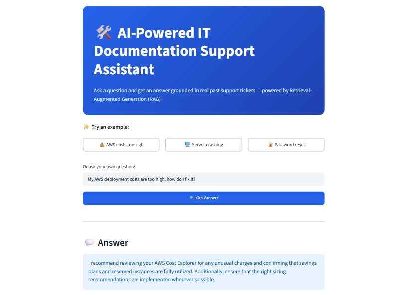

# 🛠️ AI-Powered IT Documentation Support Assistant


🔗 **[Try the Live Demo](https://doc-assistant-rag-7veycfk2hee7q8zoxir8xb.streamlit.app)**
A Retrieval-Augmented Generation (RAG) system that answers IT support questions by retrieving relevant past support tickets and generating grounded, natural-language answers using an LLM.

## 🎯 Problem
IT support teams handle thousands of repetitive tickets. Finding relevant past resolutions manually is slow. This assistant lets anyone ask a natural language question and instantly get an answer grounded in real historical support data — instead of searching through spreadsheets or ticket systems.

## 🏗️ Architecture
```
User Question → Embedding Model → ChromaDB (semantic search) → Top-K relevant tickets → LLM (Groq/Llama 3.1) → Generated Answer
```

## 🧰 Tech Stack
- **Language:** Python
- **Embeddings:** sentence-transformers (all-MiniLM-L6-v2)
- **Vector Database:** ChromaDB
- **LLM:** Groq API (Llama 3.1 8B Instant)
- **Backend/UI:** Streamlit
- **Data:** Multilingual customer support ticket dataset (Kaggle), filtered to 1,391 English tickets

## ⚙️ How It Works
1. **Data Cleaning:** Filtered a multilingual support ticket dataset to English-only entries, combined subject/question/resolution into unified documents
2. **Chunking:** Split long documents into 800-character overlapping chunks (100-char overlap) to preserve context across boundaries
3. **Embedding & Indexing:** Converted 3,397 chunks into 384-dimension vectors using sentence-transformers, stored in ChromaDB for fast similarity search
4. **Retrieval:** User query is embedded and matched against stored vectors to find the most semantically relevant support tickets
5. **Generation:** Retrieved tickets are injected as context into a prompt sent to Groq's Llama 3.1 model, which generates a grounded, natural-language answer

## 🚀 Running Locally
```bash
git clone <your-repo-url>
cd doc-assistant-rag
python -m venv venv
venv\Scripts\activate       # Windows
pip install -r requirements.txt
```
Create a `.env` file with:
```
GROQ_API_KEY=your_key_here
```
Then build the index (one-time) and run the app:
```bash
python app/build_index.py
streamlit run app/ui.py
```

## 📈 Future Improvements
- Multilingual support (dataset includes German, Spanish, French, Portuguese tickets)
- Ticket category filtering (queue/priority-based search)
- Feedback loop to improve retrieval quality over time
- Deploy as a public demo (Streamlit Community Cloud)

## 📊 Dataset
[Multilingual Customer Support Tickets](https://www.kaggle.com/datasets/tobiasbueck/multilingual-customer-support-tickets) — Kagglegit --versiongit --version

## 📊 Evaluation

To validate retrieval quality, I built a small evaluation script (`app/evaluate.py`) testing 10 queries spanning different support categories (AWS costs, server crashes, password resets, database issues, performance, VPN, email outages, 2FA, licensing, and printer issues).

**Result:** 9 out of 10 queries (90%) retrieved at least one clearly relevant ticket within the top 3 results.

**Limitation identified:** Some retrieved chunks lacked a clear subject line due to character-based chunking splitting tickets mid-context rather than at natural sentence/section boundaries. A future improvement would be sentence-aware or semantic chunking that better respects document structure.

Run the evaluation yourself:
```bash
python app/evaluate.py
```
## 🛡️ Grounding & Safety

During testing, I discovered the LLM would sometimes fall back on its own general knowledge for out-of-scope questions (e.g., answering "What's the capital of France?" with "Paris" even after noting the tickets weren't relevant). This is a common RAG failure mode where the model doesn't stay strictly grounded in retrieved context.

**Fix:** I tightened the prompt to explicitly instruct the model to rely only on retrieved tickets and to return a fixed refusal message when no relevant information exists, rather than supplementing with outside knowledge. This ensures answers are always traceable back to the actual ticket database — critical for trust in a real support tool.
